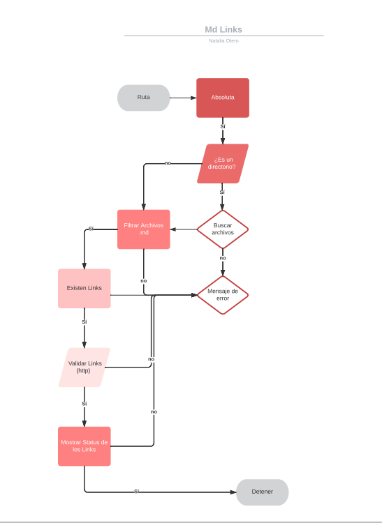

# Markdown Links

## 1. Preámbulo

Markdown Links
Se encarga de buscar los links que se encuentran dentro de un archivo Markdown. Se debe ingresar la ruta del archivo  que se quiere evaluar, ya sea mediante una ruta relativa o absoluta.

Opciones 🔑
Se puede utilizar con una serie de opciones.

Sin opciones: al ejecutar el paquete sin opciones ( colocando sola la ruta del archivo)se muestra por consola la informacion de los links encontrados en el archivo MD. 

Validate: al ejecutar el paquete con la opción validate --v o --validate, e muestra por consola la informacion de los links encontrados en el archivo MD, junto con el status de estos (respuesta http). 

Stats: al ejecutar el paquete con la opción stats --s o --stats,se muestra por consola la cantidad de links encontrada en el archivo, y cuantos de estos son únicos.

Stats y Validate: al ejecutar el paquete con las opciones --s --v o --stats --validate, sse muestra por consola la cantidad de links encontrada en el archivo, cuantos de estos son únicos y cuantos estan rotos (Broken).

Dependencias 🔗
El paquete se desarrolló en JavaScript, haciendo uso de las siguientes dependencias fuera de node.js:

1.- Módulo chalk.
2.- Módulo figlet.
3.- Módulo process con process.argv[]. 
4.- Módulo path. 
5.- Módulo fs.

Diagrama de Flujo 

